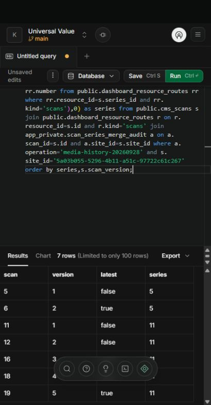

# Media scan history consolidation

Date: 2026-09-28. User explicitly requested merging existing equivalent media scans chronologically. Applied through the Supabase SQL Editor using the computer-use skill.

## Destination and preflight

Project Universal Value (nxibjpprjorchjeoudss), Kazama's Org, main. Matching gateway and media signature were installed; the CLI ledger still ended at 20260928000300 because later migrations were applied manually. No ledger repair or historical migration replay was performed. Read-only inspection found exactly two matching groups, both in kazama-test / universal-test, with no active scan or confirmed CMS operation. Other scans/sites were excluded.

## Result

| Series | Existing scan numbers in chronological order | Versions | Latest |
| --- | --- | --- | --- |
| 5 | 5, 6 | V1–V2 | 6 |
| 11 | 11, 12, 16, 18, 19 | V1–V5 | 19 |

Seven records now occupy two list entries. IDs, public routes/numbers, occurrence evidence, operations, original repeated_from provenance and timestamps remain unchanged. Only series_id, scan_version and is_latest were updated. The transaction asserted all other scan columns were unchanged. Before/after grouping metadata is retained in app_private.scan_series_merge_audit (no anon/authenticated grants). A fixed operation key makes repeated execution a no-op. The original editor execution returned a temporary-relation error after persisting the transaction; a separate read verified all seven audit rows and exact final versions. No second mutation was attempted.

The reusable [maintenance script](../../scripts/sql/merge-media-scan-history.sql) now uses one atomic DO block, with explicit site/account/expected-count placeholders, table locks, timeout, active-operation checks and rejection of split series. It must only be executed after a matching preview and explicit authorization; it is not a general migration.

Synthetic PGlite tests cover chronological merging, preserved source evidence/URLs/provenance, text and tenant exclusions, idempotency, next-version allocation, active-scan rejection and mismatched scope/count rollback. They do not establish production multi-session concurrency. Remote verification used read-only SQL after the authorized metadata update. No provider write, scan admission, quota consumption or Webflow request was initiated.

