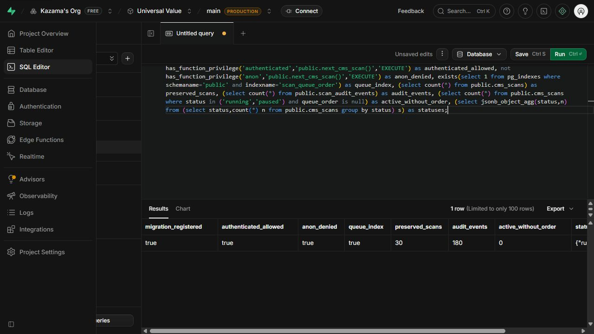

# CMS scan queue deployment

Date: 2026-09-28. Applied with explicit user authorization through the authenticated Supabase SQL Editor.

## Destination and preflight

- Project: Universal Value (`nxibjpprjorchjeoudss`), Kazama's Org, main PRODUCTION.
- Latest registered migration: `20260928000200_start_scans_atomically`.
- Queue column and selector were absent.
- 30 scans: 29 completed, 1 running. 180 scan audit events.

## Applied

Only `20260928000300_scan_queue.sql` was executed. Its exact source was registered in `supabase_migrations.schema_migrations` in the same transaction, followed by a PostgREST schema reload notification. No historical migrations were replayed.

## Verification

- Migration registered; queue index exists.
- Authenticated users can execute `next_cms_scan`; anonymous users cannot.
- All 30 scans and 180 audit records preserved, with unchanged status counts.
- No running/paused scan lacks its queue order.
- No live Webflow scan or customer content mutation was initiated for this deployment.

Local validation before deployment passed: lint, typecheck, 895 tests across 164 files, and production webpack build. PGlite coverage does not prove production multi-session concurrency. Live end-to-end queue execution has not been tested in this deployment.

The dashboard must remain open, visible and online to advance confirmed scans. Paused scans require explicit resume or cancellation.

